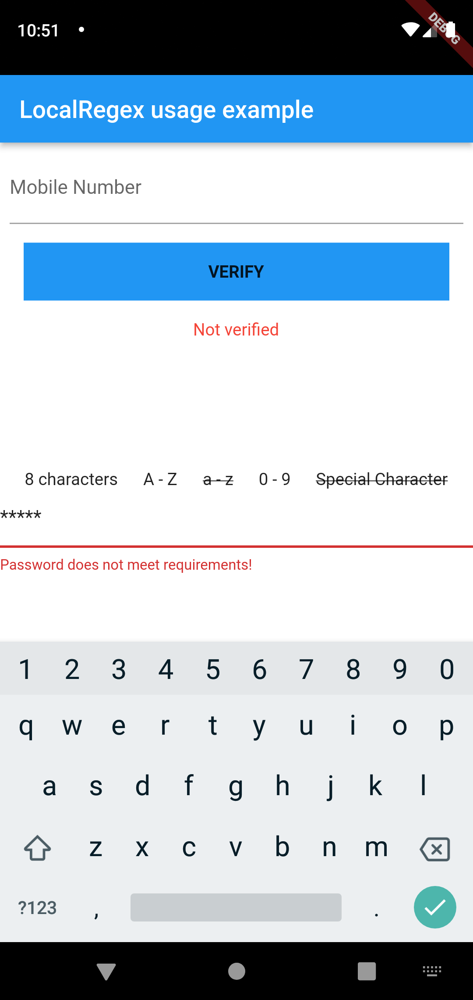
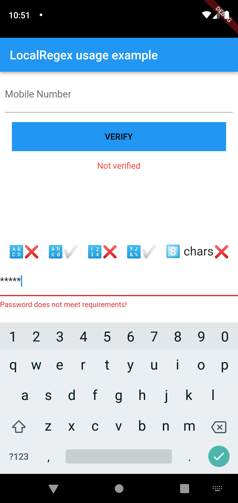

# [LocalRegex](https://pub.dev/packages/localregex/)


This plugin allows developers to check if an input matches common regex patterns in Zimbabwe and other countries.
This plugin works for all Flutter supported platforms i.e. Android, iOS, Web and Desktop (Linux, Windows & MacOS).

> Developed by Ngonidzashe Mangudya.

## Usage
### Add dependency
```yaml
dependencies:
  localregex: ^3.0.2+1
```

### Or
```shell
flutter pub add localregex
```

### Import package
```dart
  import 'package:localregex/localregex.dart';
```

> Note that declaration and initialization is no longer necessary

### Check if a mobile number matches patterns for Econet, Netone or Telecel numbers

```dart
LocalRegex.isNetone('mobile_number');
LocalRegex.isEconet('mobile_number');
LocalRegex.isTelecel('mobile_number');
```

### Check if a mobile number matches any of the patterns for Econet, Netone or Telecel
```dart
LocalRegex.isValidZimMobile('mobile_number');
```

### Check if mobile number is valid (recommended for numbers not from Zimbabwe)
```dart
LocalRegex.isValidMobile('mobile_number');
```

### Check if a supplied email matches proper email patterns
```dart
localregex.isEmail('email_address');
```

### Check if a supplied national id matches the pattern for Zimbabwean national id
```dart
localregex.isValidZimID('national_id');
```

### Check passport number
```dart
localregex.isValidZimPassport('passport_number');
```

### Check number plate
```dart
localregex.isValidZimVehicleNumberPlate('number_plate');
```

### Check driver's license
```dart
localregex.isValidZimDriversLicence('drivers_license');
```

### Check mobile number and returns mobile number in required format (for use with Zim numbers only)
``` dart
String? number = LocalRegex.formatNumber(
  value: '+263777213388',
  type: FormatTypes.regular,
);
```

### Check if password is valid (minimum of 8 characters, at least 1 special character, 1 capital letter, 1 numeric character)
```dart
LocalRegex.isValidPassword('your_password');
```

## Mobile Number Format Types
### Regular
> This is the general format of mobile numbers e.g. 0777213388
``` dart
FormatTypes.regular
```

### Common
> This is the mobile number format with country code but no + sign e.g. 263777213388
``` dart
FormatTypes.common
```

### Common Plus
> This is the mobile number format with country code and + sign e.g. +263777213388
``` dart
FormatTypes.commonPlus
```

## PasswordTextFormField

This a custom text form field that validates the password. It is recommended to use this field instead of the default text form field. It has the option to show which requirements have been met and which have not. The default password validation section can also be overwritten by supplying a function that returns a Widget.

### Usage:

```dart
PasswordTextFormField(
  controller: passwordController,
  overrideValidationRow: true,
  customValidationSection: customValidationSection,
  decoration: InputDecoration(
    border: InputBorder.none,
  ),
  autovalidateMode: AutovalidateMode.onUserInteraction,
  showValidationRow: true,
)
```

### Override Custom Validation Section
Supply a function that returns a Widget that will be displayed in the validation section.

#### Structure Of The Function
```dart
Widget customValidationSection({
  required bool hasEightCharacters,
  required bool hasCapitalLetter,
  required bool hasSmallCapsLetter,
  required bool hasADigit,
  required bool hasASpecialCharacter,
}) {
  return Container(
    height: 50,
    child: Row(
      mainAxisAlignment: MainAxisAlignment.spaceEvenly,
      children: [
        Row(
          children: [
            Text(
              "🔠",
              style: TextStyle(
                fontSize: 20,
              ),
            ),
            Text(
              hasCapitalLetter ? "✅" : "❌",
              style: TextStyle(
                fontSize: 20,
              ),
            ),
          ],
        ),
        Row(
          children: [
            Text(
              "🔡",
              style: TextStyle(
                fontSize: 20,
              ),
            ),
            Text(
              hasSmallCapsLetter ? "✅" : "❌",
              style: TextStyle(
                fontSize: 20,
              ),
            ),
          ],
        ),
        Row(
          children: [
            Text(
              "🔢",
              style: TextStyle(
                fontSize: 20,
              ),
            ),
            Text(
              hasADigit ? "✅" : "❌",
              style: TextStyle(
                fontSize: 20,
              ),
            ),
          ],
        ),
        Row(
          children: [
            Text(
              "🔣",
              style: TextStyle(
                fontSize: 20,
              ),
            ),
            Text(
              hasASpecialCharacter ? "✅" : "❌",
              style: TextStyle(
                fontSize: 20,
              ),
            ),
          ],
        ),
        Row(
          children: [
            Text(
              "8️⃣ chars",
              style: TextStyle(
                fontSize: 20,
              ),
            ),
            Text(
              hasCapitalLetter ? "✅" : "❌",
              style: TextStyle(
                fontSize: 20,
              ),
            ),
          ],
        ),
      ],
    ),
  );
}
```

## Screenshot
<table>
   <tr>
      <td> Default</td>
      <td> Using The Override Option</td>
   </tr>
   <tr>
      <td>
      <td>
   </tr>
</table>
